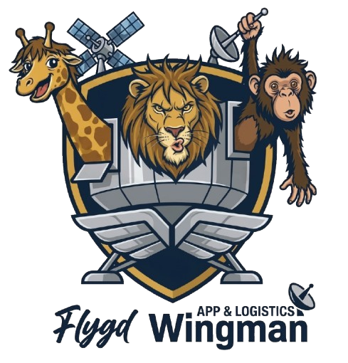
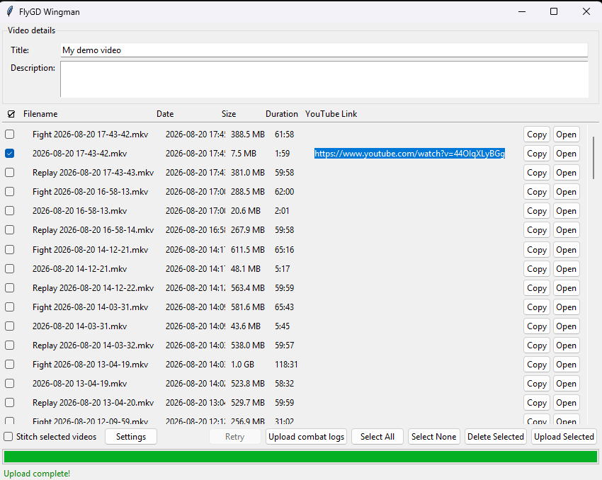

<p align="center">
  
</p>

<h1 align="center">FlyGD Wingman</h1>

<p align="center"><strong>Your OBS recording wingman.</strong></p>

<p align="center">
  <a href="https://wingman.zoolanders.vip/">Website</a> ·
  <a href="https://github.com/elboaf/FlyGD-Wingman/releases">Download</a> ·
  <a href="https://wingman.zoolanders.vip/privacy">Privacy Policy</a> ·
  <a href="https://wingman.zoolanders.vip/terms">Terms of Service</a>
</p>

FlyGD Wingman is a free, open-source Windows desktop application. It sits in
your system tray, watches the folder OBS Studio saves recordings to, and gives
you one window to review what you just recorded, optionally stitch several
clips into one video, and upload the ones you choose to your own YouTube
channel. Nothing is uploaded until you select it and press the button.

It was built for EVE Online fight footage — so it can also bundle the EVE
combat logs covering a recording and post them to a Discord webhook you
configure — but the OBS-to-YouTube workflow works with any OBS recording.

<p align="center">
  
</p>

## What Wingman does

- **Watches your OBS recording folder.** The folder is detected from OBS
  Studio's own configuration on first run; you can also point it anywhere.
- **Notifies you when a recording is ready** — a tray notification by default,
  or it can raise the window immediately.
- **Lists your recordings** with filename, date, size, and duration.
- **Stitches a selection into one video** (via bundled FFmpeg), earliest
  recording first.
- **Uploads what you select to your YouTube channel**, with a title,
  description, privacy setting, and category you control. Uploads are
  resumable and retry transient network failures.
- **Shows the resulting YouTube link** in the list, with Copy and Open buttons.
- **Deletes recordings from your local disk** after an explicit confirmation.
  This only ever touches local recording files, never anything on YouTube.
- **Bundles EVE Online combat logs to Discord** — secondary, entirely optional,
  and unrelated to your Google account. See
  [Discord & EVE combat logs](#discord--eve-combat-logs).

## Typical workflow

1. You record something in OBS Studio.
2. Wingman notices the finished recording and notifies you.
3. You click the tray icon to open the window.
4. You tick the recording(s) you want.
5. Optionally tick **Stitch selected videos** to merge them into one.
6. You fill in a title and description and press **Upload**. Leave **Also
   post combat logs to Discord** ticked to have Wingman collect the EVE
   logs covering the recording and post them alongside.
7. Wingman uploads directly to your YouTube channel — on first upload it opens
   your browser so you can sign in to Google and grant permission.
8. The **Link** column marks the row with ↗. Right-click it to **Copy link**
   or **Open in browser**, or just double-click the row.

## Google & YouTube access

Wingman requests exactly one Google OAuth scope:

```
https://www.googleapis.com/auth/youtube.upload
```

In plain English: this permission lets Wingman upload video files you have
selected to the YouTube channel of the Google account you signed in with. It
is the narrowest scope that allows a video upload, and it is the only scope
the application asks for.

**Why it is required.** Uploading a video is the application's core purpose.
The YouTube Data API endpoint Wingman calls is
[`videos.insert`](https://developers.google.com/youtube/v3/docs/videos/insert),
which requires this scope. Wingman makes no other YouTube API call.

**What this means in practice:**

- **Uploads only happen when you start them.** Wingman never uploads
  automatically. A video is uploaded only after you tick it and press
  **Upload**, and the combat logs go with it only while that box is ticked.
  Detecting a new recording produces a notification and a list entry —
  nothing more.
- **Sign-in only happens when you ask for it**, either via
  **Settings → Connect Google Account** or automatically at the moment of your
  first upload if you have not connected yet.
- **Wingman does not request access to Gmail**, Google Drive, Google Contacts,
  Google Photos, or your Google profile.
- **Wingman does not request the broader `youtube` or `youtube.force-ssl`
  scopes**, so it has no access to your viewing history, subscriptions,
  playlists, comments, or analytics. The only YouTube API method it calls is
  `videos.insert` — it never lists, reads, edits, or deletes anything already
  on your channel.
- **Your Google credentials are stored locally**, on your own computer, by the
  desktop application. See [Where credentials live](#where-credentials-live).
- **Google OAuth tokens are not sent to any FlyGD server.** Wingman has no
  backend. It talks to Google directly and to a Discord webhook you configure;
  there is nothing else it can talk to.
- **Video data goes straight from your computer to Google.** The upload is a
  resumable upload made by the application to the YouTube Data API. It does
  not pass through any FlyGD-controlled infrastructure.

### OAuth flow

Wingman uses Google's OAuth 2.0 flow for **installed / desktop applications**.
Pressing **Connect Google Account** opens your default browser at Google's
consent screen; Google redirects back to a temporary loopback listener
(`http://localhost` on an ephemeral port) that the application starts for the
duration of the sign-in and then shuts down. The client configuration embedded
in official builds is a desktop-application OAuth client, for which Google
documents that the client secret is not treated as confidential — the flow's
security comes from the loopback redirect and your own consent.

### Where credentials live

The resulting credentials — including the refresh token, so you do not have to
sign in again on every launch — are written to a JSON file in your Windows
user profile:

```
%LOCALAPPDATA%\OBSYouTubeUploader\token.json
```

To be precise about what that does and does not give you: the file is stored
in your per-user profile directory, and the application asks the operating
system for owner-only permissions on it. On Linux and macOS (used for
development and CI) that request is enforced. **On Windows it is not** —
Python's `os.chmod` only toggles the read-only attribute there and does not
set a real ACL. The file is **not encrypted**, and Wingman does **not** use
Windows Credential Manager or DPAPI. Treat it as a plaintext credential
sitting in your user profile: anyone who can read your profile directory, or
who is an administrator on the machine, can read it.

### Revoking access

You can revoke Wingman's access at any time from your Google Account:
**Google Account → Security → Your connections to third-party apps &
services**, or directly at
[myaccount.google.com/connections](https://myaccount.google.com/connections).
Removing access there immediately invalidates the stored token. You can also
simply delete `%LOCALAPPDATA%\OBSYouTubeUploader\token.json` to sign out
locally.

### YouTube Terms of Service

Wingman uploads through the YouTube Data API, so videos you upload with it are
subject to the [YouTube Terms of Service](https://www.youtube.com/t/terms) and
the [YouTube Community Guidelines](https://www.youtube.com/howyoutubeworks/policies/community-guidelines/).
The link to YouTube's terms is also shown in the application itself, in
**Settings → Google account**, next to the sign-in button.

For the full data-handling statement, see the
[FlyGD Wingman Privacy Policy](https://wingman.zoolanders.vip/privacy).

## Discord & EVE combat logs

This feature is optional, off until you configure it, and **completely
separate from Google sign-in**. It uses no Google credentials and sends no
Google user data anywhere.

With **Also post combat logs to Discord** ticked, an upload does a second
thing once the video is published: it works out the time span the selected
recordings cover, collects the EVE Online gamelog files from your local
`Gamelogs` folder that overlap that span, zips them, and posts the archive to
the Discord webhook URL you entered in Settings. That is the entire scope of
the feature: local EVE log files, to a Discord channel you chose.

Untick the box to upload the video alone.

Notes:

- EVE writes log timestamps in UTC, and the window is computed in UTC, so it
  can look offset from your system clock by your local UTC offset. That is
  expected.
- Discord caps webhook attachments at 10 MB. A realistic 16-log archive from
  one fight compresses to roughly 38 KB, so this rarely comes up. If it does —
  or if the post fails for any other reason — the archive is kept on disk and
  its path is shown so you can upload it by hand. It is deleted only after a
  successful post.

> **A Discord webhook URL is a bearer credential.** Anyone who has it can post
> to that channel, it never expires, and the only way to revoke it is to delete
> the webhook in Discord. Wingman stores it in plaintext in `settings.json` and
> redacts it from its own log file, but that does not help if you paste it
> elsewhere. Do not post it publicly or leave it visible in a screenshot.

## Installation

1. Download the latest installer from the
   [Releases page](https://github.com/elboaf/FlyGD-Wingman/releases).
   It is named `FlyGD-Wingman-Setup-<version>.exe`; releases published before
   the rename are named `OBS-YouTube-Uploader-Setup-<version>.exe`.
2. Run it. It installs per-user, so there is no administrator prompt.
3. Launch Wingman. It appears in the system tray. Connect your Google account
   when you make your first upload, or up front via **Settings → Connect
   Google Account**.

Python, FFmpeg, and the OAuth client configuration are bundled — there is no
separate OBS script to install, and no Google Cloud project for you to set up.

**Windows will warn you** that it "protected your PC": the installer and the
application are not code-signed. Click **More info** → **Run anyway**. This
happens once per machine, for the installer and for the first launch. This is
about code signing, and is unrelated to Google sign-in.

## Settings

| Setting | Default | Notes |
|---|---|---|
| Privacy | `unlisted` | `private`, `unlisted`, or `public` |
| Category ID | `20` (Gaming) | [YouTube category IDs](https://developers.google.com/youtube/v3/docs/videoCategories/list) |
| When a recording finishes | Tray notification | Or open the uploader window immediately |
| Discord webhook | *(none)* | Channel → Integrations → Webhooks → Copy URL. Treat it like a password. |
| Gamelogs folder | auto-detected | Usually `Documents\EVE\logs\Gamelogs` |
| Recording folder | auto-detected from OBS | Browse or re-detect at any time |

Settings are stored at `%LOCALAPPDATA%\OBSYouTubeUploader\settings.json`.

## Privacy

Wingman is local-first. It has no backend, no account system, no analytics,
and no telemetry. Everything it stores — your settings, your Google OAuth
token, its log file, and temporary stitched video files — lives under
`%LOCALAPPDATA%\OBSYouTubeUploader\` on your own machine.

The application makes network connections to exactly two places, both of which
you initiate:

| Destination | When | What is sent |
|---|---|---|
| Google / YouTube APIs | You sign in, or upload a video | OAuth sign-in, and the video files you selected plus the title, description, privacy, and category you set |
| A Discord webhook you configure | You press **Upload** with **Also post combat logs to Discord** ticked | A zip of the local EVE log files covering the selected recordings, plus a short summary message |

Your Google account data is never sent to Discord, and no Google OAuth token
ever leaves your machine. Full statement:
[Privacy Policy](https://wingman.zoolanders.vip/privacy) ·
[Terms of Service](https://wingman.zoolanders.vip/terms).

## Upload limits

YouTube upload capacity is governed by the YouTube Data API quota granted to
this project. That quota is **per project and shared across every user of the
application**, not per Google account, so heavy use by one person can exhaust
it for everyone else until it resets (daily, at midnight Pacific Time). When
that happens, Wingman recognises the API's `quotaExceeded` response and says
so in plain language rather than showing an error code — wait until the
following day.

A second, separate limit applies to **your own channel**: YouTube caps how
many videos one channel may upload per day, and rejects the video with
`uploadLimitExceeded` once you pass it. This one affects only you, not other
users of the app, and it is reported separately. The cap is tightest on
channels that are new or not phone-verified — verifying at
[youtube.com/verify](https://www.youtube.com/verify) raises it (and lifts the
15-minute limit on video length). The allowance resets, so wait a day and
upload again.

## Upgrading from 1.x

1. In OBS, open **Tools → Scripts** and remove the old script (`obs_trigger.py`
   or similar). It is no longer used — the tray application watches the
   recording folder directly.
2. Uninstall or delete your old checkout; it is not needed once the tray
   application is installed.
3. After installing, open **Settings → Connect Google Account** and sign in
   once. Old `client_secrets.json` and token files are not reused — there is no
   migration of stored credentials or settings.

## Building from source

```bash
python -m pip install -e ".[dev]"
python -m pytest tests/
uv run --extra dev ruff check .
python -m obs_youtube_uploader
```

### After cloning

```
git config blame.ignoreRevsFile .git-blame-ignore-revs
```

The repository was reformatted with `ruff format` in one commit touching
136 files. Without this setting, `git blame` attributes all of them to
that reformat rather than to whoever wrote the code. The setting is
per-clone and cannot be committed, so every clone needs it once.

Note that `.git-blame-ignore-revs` has no active entry until the
reformat's commit hash is recorded in it — see the TODO in that file.
Until then, running the command above is harmless but changes nothing.

Official releases are built by
[`.github/workflows/release.yml`](.github/workflows/release.yml), which injects
the project's own Google OAuth desktop-client configuration from repository
secrets at build time. **Those credentials are never committed to this
repository** — `obs_youtube_uploader/credentials.py` contains only
placeholders in the source tree.

So a build from source has no working OAuth client until you supply your own.
To run it end to end you need to create a Google Cloud project, enable the
YouTube Data API v3, create an **OAuth client ID of type "Desktop app"**, and
put its client ID and secret into `CLIENT_CONFIG` in
`obs_youtube_uploader/credentials.py`. Everything except **Connect Google
Account** works without this. Do not commit real credentials back to the
repository.

The Python package directory, the executable name, and the
`%LOCALAPPDATA%` state folder are all still named `obs_youtube_uploader` /
`OBSYouTubeUploader`. These are internal identifiers kept unchanged so that
existing installations keep their settings and stay upgradeable; only the
product name has changed.

Packaging lives in [`packaging/`](packaging/) (PyInstaller spec and Inno Setup
script). Manual pre-release verification steps are in
[`docs/smoke-checklist.md`](docs/smoke-checklist.md).

## Support

- Bugs and feature requests:
  [GitHub Issues](https://github.com/elboaf/FlyGD-Wingman/issues)
- Email: [technical@zoolanders.vip](mailto:technical@zoolanders.vip)
- Product information: [wingman.zoolanders.vip](https://wingman.zoolanders.vip/)

For anything touching your Google account or the data Wingman handles, email is
the fastest route — please do not include tokens, webhook URLs, or other
credentials in a public issue.

## License and affiliations

Copyright (C) 2026 elboaf and the FlyGD Wingman contributors.

Released under the [GNU General Public License, version 3 only](LICENSE) (`GPL-3.0-only`).

This program is free software: you can redistribute it and/or modify it
under the terms of the GNU General Public License as published by the
Free Software Foundation, version 3.

This program is distributed in the hope that it will be useful, but
WITHOUT ANY WARRANTY; without even the implied warranty of
MERCHANTABILITY or FITNESS FOR A PARTICULAR PURPOSE. See the GNU
General Public License for more details.

FFmpeg and AutoHotkey are bundled and are licensed under the GPL. See
[THIRD-PARTY-NOTICES.md](THIRD-PARTY-NOTICES.md) for versions, sources, and
a written offer of source.

FlyGD Wingman is an independent, unofficial project. It is not affiliated
with, endorsed by, or sponsored by Google LLC, YouTube, the OBS Project /
OBS Studio, CCP hf. / EVE Online, or Discord Inc. Google, YouTube, OBS Studio,
EVE Online, and Discord are trademarks of their respective owners and are used
here only to describe compatibility.

EVE Online and all related logos and images are trademarks or registered
trademarks of CCP hf.
